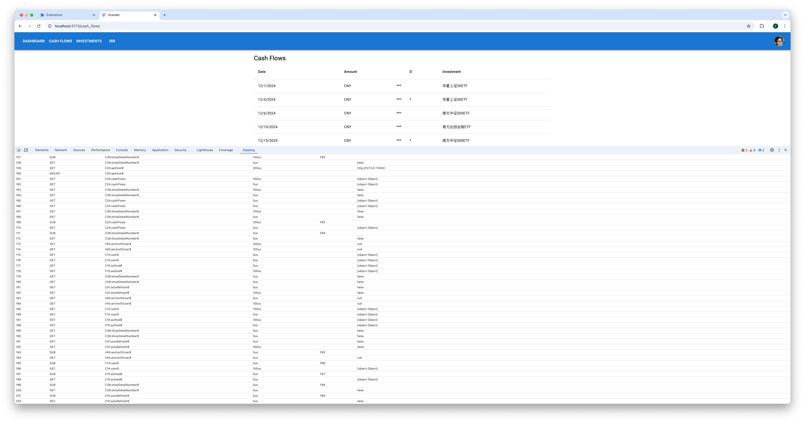
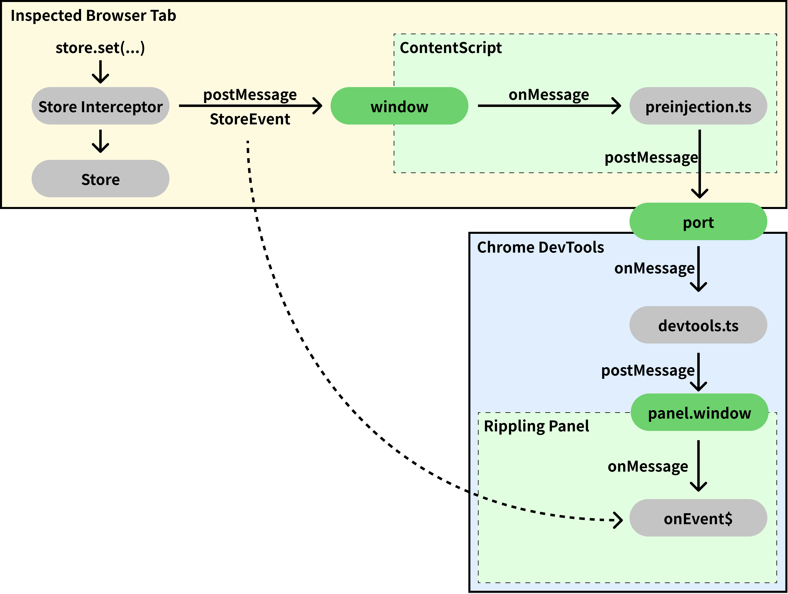

# Devtools

Rippling has a Chrome extension that allows developers to inspect the state of store.

## How to use

1. use `createDebugStore` instead `createStore`

```typescript
let store: Store;
if (import.meta.env.DEV) {
  // use debug store and attach chrome devtools
  const interceptor = setupDevtoolsInterceptor(window);
  store = createDebugStore(interceptor);
} else {
  // use production environment use a normal store
  store = createStore();
}
```

2. install the chrome extension. `TODO: add link here`

3. Open Chrome Devtools and select the Rippling tab.



## How it works

- `setupDevtoolsInterceptor` will create an interceptor that will send all store events to `window.postMessage`
- Chrome extension will use content scripts to listen to `window.onMessage` and dispatch the message to the extension.


